  

## 🧭 Tentang Saya

> Saya membantu orang dan tim bekerja lebih lancar melalui dukungan teknis yang terstruktur, komunikasi yang jelas, dan perhatian pada pengalaman pengguna.

- 💼 CTO @ Yorukaze Production — mengelola website, hardware support & komunitas Discord 2.500+ anggota
- 🎨 UI/UX Designer Intern — Niagahoster × Rakamin
- 🎓 Lulusan Information Technology
- 📈 Saat ini memperdalam **Business Data Analytics** di Purwadhika Digital Technology School

## 🛠️ Skill

## 📌 Featured

| Proyek | Deskripsi |
|---|---|
| [namokai/myweb](https://github.com/namokai/myweb) | Personal portfolio — Next.js 14 + Three.js cosmic background, dark glassmorphism |
| [namokai/capstone-module3-jne](https://github.com/namokai/capstone-module3-jne) | Capstone Module 3 JC BDA — analisis operasional 300.000 pengiriman JNE: SLA, retur COD vs Prepaid, dan kualitas data (Jupyter Notebook) |
| [namokai/CRUDProject](https://github.com/namokai/CRUDProject) | Capstone Module 2 JC BDA — aplikasi CRUD berbasis CLI (Python) untuk manajemen data pasien rumah sakit: tambah, lihat, ubah, dan hapus record pasien dari terminal |

## 📫 Kontak

